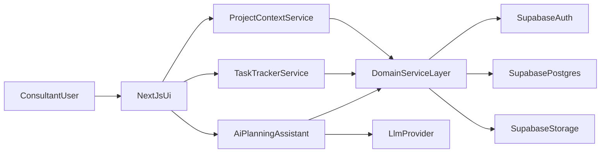

# Done - System Design Overview (Single User)

## Purpose
Define a planning-level architecture for a single-user Workday integration consultant workflow where `Project` is the central model.

## Scope
- Logical architecture and data flow only.
- No implementation contracts or finalized schema fields.

## Design Principles
- Project-first navigation and data organization.
- Single-user simplicity over collaborative complexity.
- Clear relationship path: `Project -> PrimaryRole -> Integration -> Task`.
- AI is assistive and user-confirmed.
- Clean and modern UX as a top-level product objective.

## Core Components
- `Next.js Web App`: primary user interface and interaction layer.
- `Domain Service Layer`: enforces workflow rules and model boundaries.
- `Project Context Engine`: resolves current project, role, and integration context.
- `Task Tracker Service`: manages task creation, linking, filtering, and views.
- `AI Planning Assistant`: generates suggestions, next actions, and breakdowns.
- `Supabase Postgres`: system of record for planning entities.
- `Supabase Auth`: single-user authentication.
- `Supabase Storage`: optional support for related artifacts.

## High-Level Architecture

## Primary User Flow
1. User captures or updates a project assignment.
2. User sets one primary role for that project.
3. User tracks one or more owned integrations under the project.
4. User creates tasks tied to project and optionally integration.
5. User reviews tasks in either:
   - global task view,
   - integration-context task view.
6. User requests AI assistance for planning and prioritization.

## Data Flow Scenarios

### Project-Centered Task Creation
1. User enters task from project context.
2. Domain layer enforces project linkage.
3. Optional integration linkage is validated against current project.
4. Task appears in global task list and integration view (if linked).

### AI-Assisted Planning
1. User requests suggestions for a project or integration.
2. AI assistant gathers context from domain layer.
3. AI response is presented as suggestions only.
4. User accepts/rejects suggestions before any persisted updates.

## UX Structure Notes (Planning)
- Default landing: project-centric dashboard.
- Persistent context bar: active project, primary role, active integration filter.
- Task presentation supports two perspectives without duplicating data.
- Visual design direction: sleek spacing, restrained color usage, strong hierarchy.

## Non-Functional Targets (Initial)
- Non-AI interaction response target: <= 500ms P95.
- AI suggestion response target: <= 8s.
- Reliability target for personal daily use: >= 99.5%.

## Open Design Decisions
- Whether to include background jobs in MVP or defer.
- Canonical state model for project, integration, and task lifecycles.
- Which UI pattern best supports fast switching between projects and integrations.
