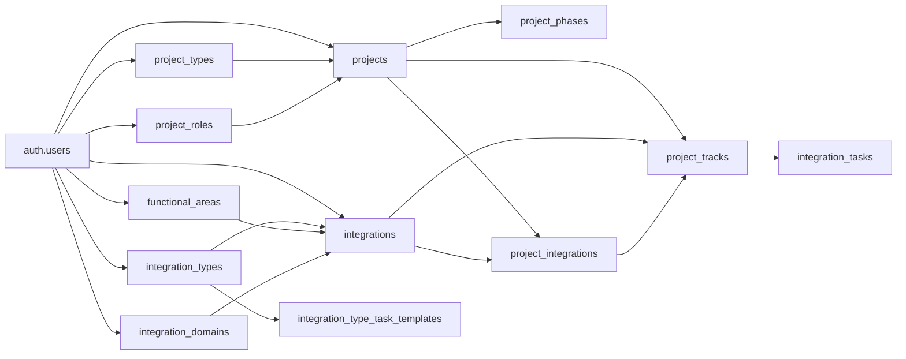

# Done - Domain Model (MVP schema baseline)

## Purpose

Describe the first concrete persistence model for the web app (Next.js + Supabase). This updates the earlier collaborative draft with **field-level tables** for **Projects**, **phases**, **Integration catalog** (extended), **project integration links**, **integration-scoped tasks**, and **integration type task templates** (for future seeding). **AiSuggestion** remains out of scope.

## Implementation

- Base migration: [`web/supabase/migrations/20260227120000_initial_domain.sql`](/Users/davidreichardt/Done-App/web/supabase/migrations/20260227120000_initial_domain.sql)
- Integrations + lookups: [`web/supabase/migrations/20260328120000_integrations_extended.sql`](/Users/davidreichardt/Done-App/web/supabase/migrations/20260328120000_integrations_extended.sql)
- Integration tasks + templates: [`web/supabase/migrations/20260328120001_integration_tasks_and_templates.sql`](/Users/davidreichardt/Done-App/web/supabase/migrations/20260328120001_integration_tasks_and_templates.sql)
- Integration naming / code uniqueness: [`web/supabase/migrations/20260328140000_integrations_multiple_per_owner.sql`](/Users/davidreichardt/Done-App/web/supabase/migrations/20260328140000_integrations_multiple_per_owner.sql)
- App README: [`web/README.md`](/Users/davidreichardt/Done-App/web/README.md)

## Single-user modeling note

Planning docs described `ProjectAssignment(primaryRole)` as a separate entity. For the **single-user MVP**, the app stores **your primary role on the project** via `projects.primary_role_id` (FK to `project_roles`). A dedicated `project_assignments` table can be introduced later if multiple assignments or history are needed.

## Configurable lookups (Settings-ready)

Rows are **scoped per user** (`owner_id = auth.uid()`), with defaults inserted by trigger `seed_user_defaults` on `auth.users` insert. The app also runs `ensureDefaultLookups` if a user predates the trigger.

### `project_types`

| Column        | Type        | Notes                                                |
| ------------- | ----------- | ---------------------------------------------------- |
| id            | uuid        | PK                                                   |
| owner_id      | uuid        | FK `auth.users`, cascade delete                      |
| name          | text        | Unique per owner; e.g. Launch Flex - Base            |
| sort_order    | int         | Display order                                        |
| is_active     | boolean     | Soft-disable for Settings without breaking FKs       |
| created_at    | timestamptz |                                                      |
| updated_at    | timestamptz |                                                      |

**Default seed names:** Launch Flex - Base; Launch Flex - Extended; Launch Flex - Tailored; Launch Express.

### `project_roles`

Same shape as `project_types`.

**Default seed names:** Lead; Architect; Builder; Advisor.

### `integration_types`, `functional_areas`, `integration_domains`

Same general shape as `project_types` (owner-scoped, `sort_order`, `is_active`). Seeded on signup and via `ensureDefaultLookups` for older accounts. Used by **integrations** for classification and future **task template** rules by type.

## `projects`

| Column           | Type        | Notes                                      |
| ---------------- | ----------- | ------------------------------------------ |
| id               | uuid        | PK                                         |
| owner_id         | uuid        | FK `auth.users`                            |
| customer_name    | text        | Required                                   |
| project_type_id  | uuid        | Nullable FK `project_types`              |
| primary_role_id  | uuid        | Nullable FK `project_roles`                |
| created_at       | timestamptz |                                            |
| updated_at       | timestamptz |                                            |

## `project_phases`

Child rows per project; **add/remove/reorder** in UI over time. On project creation the app inserts five defaults.

| Column      | Type        | Notes                                                                  |
| ----------- | ----------- | ---------------------------------------------------------------------- |
| id          | uuid        | PK                                                                     |
| project_id  | uuid        | FK `projects`, cascade delete                                          |
| name        | text        | Label (e.g. Plan, Architect & configure)                               |
| sort_order  | int         | Ordering                                                               |
| start_date  | date        | Nullable                                                               |
| end_date    | date        | Nullable                                                               |
| phase_key   | text        | Optional stable key (`plan`, `architect_configure`, etc.) for analytics |
| created_at  | timestamptz |                                                                        |
| updated_at  | timestamptz |                                                                        |

**Default phases (in order):** Plan; Architect & configure; Test; Deploy; Hypercare.

## Integration catalog and project links

Integrations are **first-class catalog rows**. Projects **link** via `project_integrations` so the same integration can appear on multiple projects with **different status, progress, and tasks** per project.

### `integrations` (catalog definition)

| Column                        | Type        | Notes                                                                 |
| ----------------------------- | ----------- | --------------------------------------------------------------------- |
| id                            | uuid        | PK                                                                    |
| owner_id                      | uuid        | FK `auth.users`                                                       |
| name                          | text        | Display label (multiple rows per owner allowed)                       |
| integrating_with              | text        | Nullable; vendor or external system name                              |
| integration_code              | text        | Optional business / customer-facing label; **not** unique per owner     |
| internal_time_code            | text        | Optional on `project_only`; **required** on `catalog`; unique per owner among catalog rows (non-empty) |
| default_estimated_effort_hours  | numeric     | Nullable; suggested effort when creating a project link from this catalog pattern |
| direction                     | text        | `inbound` \| `outbound` \| `bidirectional`                            |
| integration_type_id         | uuid        | Nullable FK `integration_types`                                      |
| functional_area_id          | uuid        | Nullable FK `functional_areas`                                       |
| domain_id                   | uuid        | Nullable FK `integration_domains`                                    |
| catalog_visibility          | text        | `catalog` (picker) \| `project_only` (hidden from picker)              |
| prefilled_from_integration_id | uuid      | Nullable FK `integrations`; set on **child** `project_only` rows when instantiated from a catalog template |
| promoted_from_integration_id | uuid     | Nullable FK `integrations`; set on a **new** `catalog` row when created via promote-from-project |
| created_at                  | timestamptz |                                                                       |
| updated_at                  | timestamptz |                                                                       |

### `project_integrations` (per project)

| Column         | Type        | Notes                                                        |
| -------------- | ----------- | ------------------------------------------------------------ |
| id             | uuid        | PK (used in detail URL)                                      |
| project_id     | uuid        | FK `projects`                                                |
| integration_id | uuid        | FK `integrations`                                            |
| status         | text        | `not_started` \| `in_progress` \| `blocked` \| `on_hold` \| `done` |
| progress       | smallint    | 0–100                                                        |
| notes          | text        | Nullable                                                     |
| created_at     | timestamptz |                                                              |
| updated_at     | timestamptz |                                                              |

Unique (`project_id`, `integration_id`).

### `project_tracks`

First-class project work buckets. Every project has one `project_management` track, and each integration link has one `integration` track.

| Column                 | Type        | Notes |
| ---------------------- | ----------- | ----- |
| id                     | uuid        | PK |
| project_id             | uuid        | FK `projects` |
| kind                   | text        | `integration` \| `project_management` |
| name                   | text        | User-facing label (e.g. integration display title or `Project Management`) |
| sort_order             | int         | Display ordering within project |
| integration_id         | uuid        | Nullable FK `integrations`; set for `integration` tracks |
| project_integration_id | uuid        | Nullable FK `project_integrations`; set for `integration` tracks |
| created_at             | timestamptz | |
| updated_at             | timestamptz | |

### `integration_tasks`

Tasks **belong to** a `project_tracks` row. This supports both integration delivery tasks and project-management tasks in a single task model. Optional `due_date`; status `open` \| `done` \| `cancelled`.

### `integration_type_task_templates` (future)

Owner rows keyed by `integration_type_id` and `title` for suggested/default tasks. Empty until product rules populate them.

**Deferred / later:** Catalog pattern tasks tied to a predefined task library; standalone tasks with optional `project_integration_id`, global task list, AI suggestions.

## Security

All tables use **Row Level Security** with policies scoped to `auth.uid()` (directly on owner tables, or via project ownership for `project_phases` and `project_integrations`).

## Relationship map (current build)

## AI (out of scope)

**AiSuggestion** persistence and workflows are not modeled yet.

## Non-goals (historical)

- Multi-user orgs and permission matrices
- Workflow automation and realtime sync
